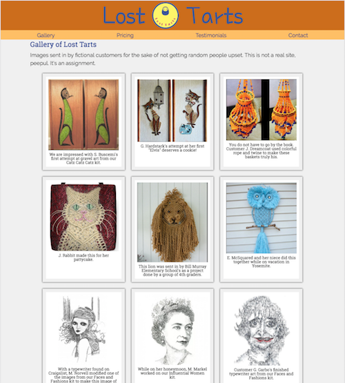

# Product Landing Page

[deployed on Surge](http://ihatetoast-losttartslandingpage.surge.sh/)

Free Code Camp's Responsive Web Design Certification project

## Lost Tarts

An HTML/CSS-only landing page for the Responsive Web Design certification. Colors chosen remind me of 70s crochet and craft patterns. 

Landing page built with a mobile-first approach. 

Toolbox:

- HTML5
- CSS
- Sass
- Flexbox

